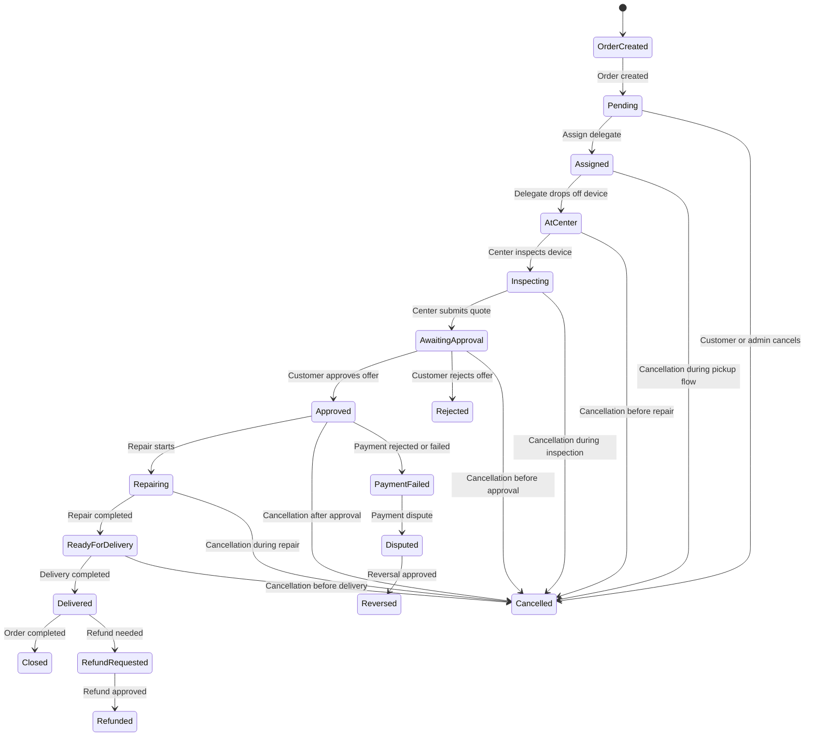
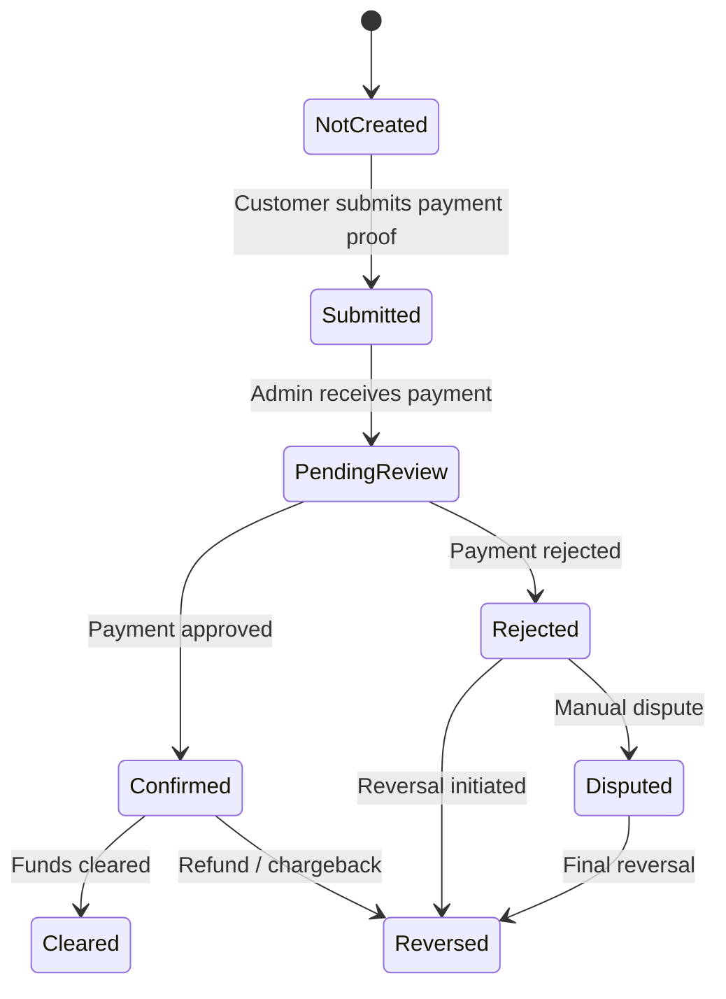
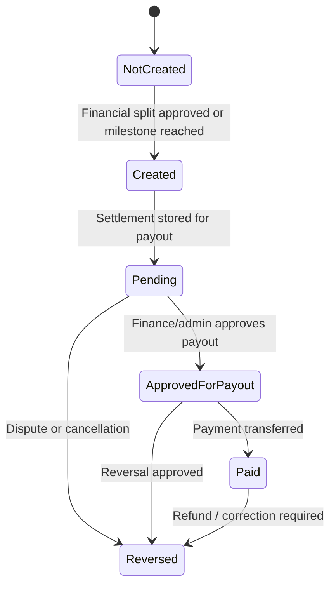
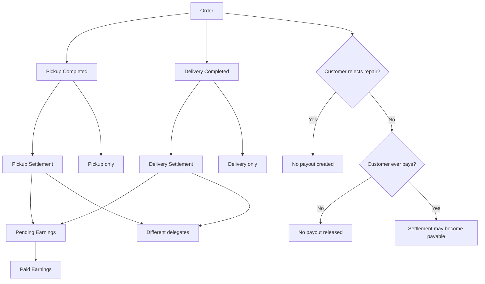
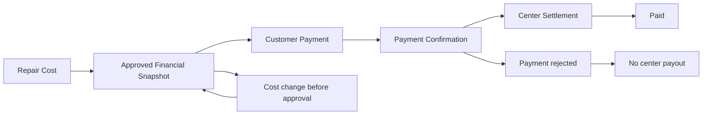
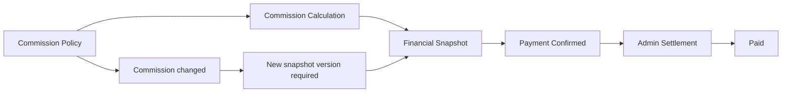
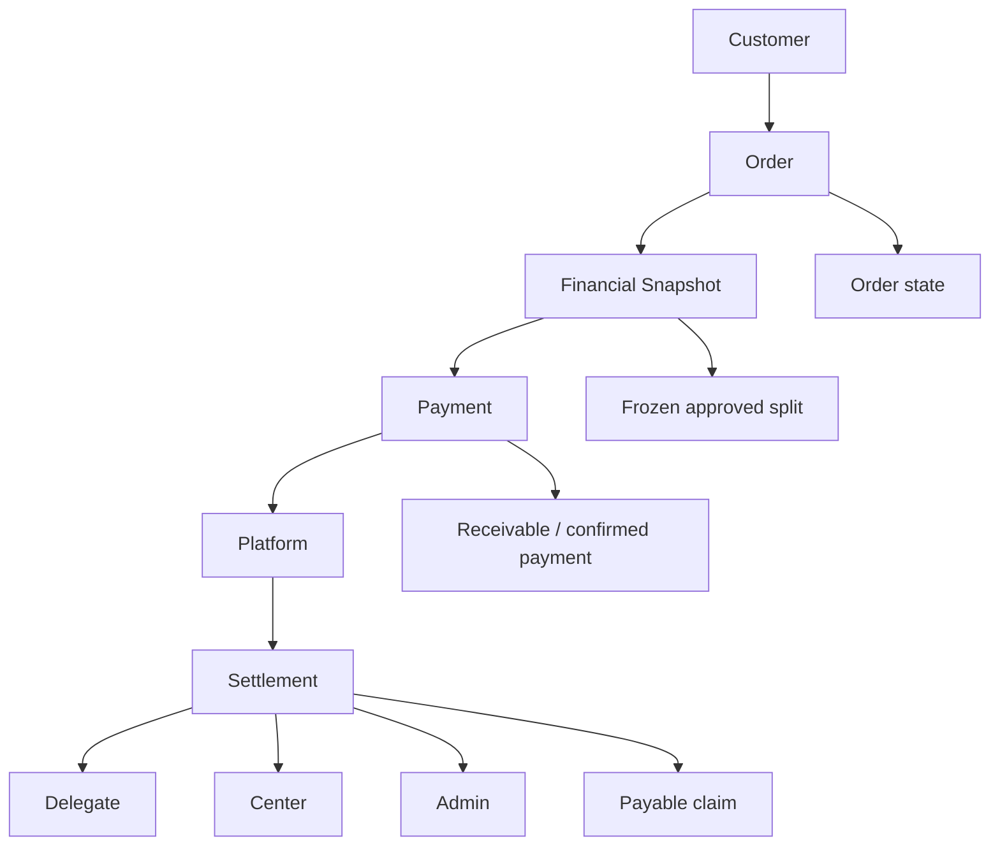
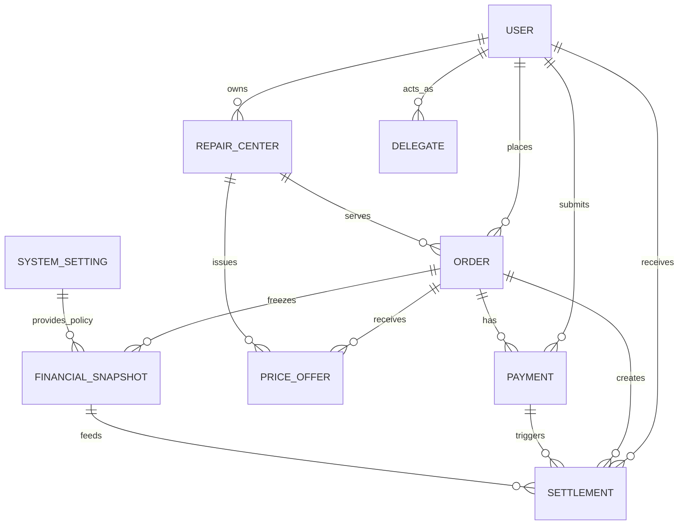

# Financial Audit: Production Accounting Review

## Overview

This document describes the financial lifecycle of the system from a production accounting perspective, using visual state machines and flow diagrams for technical documentation.

The system should be treated as a chain of four distinct financial concepts:

- Customer obligation: what the customer is contractually required to pay.
- Payment intake: what the platform has received or is awaiting.
- Payable claim: what each participant is entitled to receive.
- Financial snapshot: a frozen approved version of the financial split.

These concepts must not be treated as the same thing.

---

## 1. Order state machine

### Mermaid: Order lifecycle

### Transition details

| From | To | Trigger | Endpoint | Controller | Actor | Validation | Financial impact |
|---|---|---|---|---|---|---|---|
| OrderCreated | Pending | Create order | POST /orders | order.controller | Customer | Order payload valid | No financial claim yet |
| Pending | Assigned | Delegate assigned | PUT /orders/:id/assign-delegate | order.controller | Admin/Delegate flow | Valid delegate and order state | No money changes |
| Assigned | AtCenter | Drop-off confirmed | PUT /orders/:id/confirm-drop-center | delegate.controller | Delegate | Order must be assigned | No money changes |
| AtCenter | Inspecting | Inspection started | PUT /orders/:id/start-inspection | repairCenter controller | Center | Center must own the order | No money changes |
| Inspecting | AwaitingApproval | Price offer submitted | POST /price-offer/:orderId | priceOffer.controller | Center | Order must be at center/inspecting | Quote created, not yet approved |
| AwaitingApproval | Approved | Offer approved | PUT /orders/:id/approve-offer | priceOffer.controller | Customer | Offer exists and order is awaiting approval | Financial snapshot becomes active |
| AwaitingApproval | Rejected | Offer rejected | PUT /orders/:id/reject-offer | priceOffer.controller | Customer | Offer exists | No financial obligation remains |
| Approved | Repairing | Repair begins | PUT /orders/:id/start-repair | repairCenter controller | Center | Order approved | Repair cost becomes contractually active |
| Repairing | ReadyForDelivery | Repair completed | PUT /orders/:id/repair-complete | repairCenter controller | Center | Repair completed | No new money yet |
| ReadyForDelivery | Delivered | Delivery completed | PUT /tasks/:orderId/confirm-delivery | delegate.controller | Delegate | Order returning | Delivery payout may be created |
| Delivered | Closed | Order finalized | POST /orders/:id/close | order.controller | Admin | Delivery completed and all finances settled | Final state |
| Any active state | Cancelled | Cancellation | PUT /orders/:id/cancel | order.controller | Customer/Admin | Allowed transition only before final settlement | Reversal/refund may be required |
| Approved | PaymentFailed | Payment rejected | PUT /payments/:paymentId/review | priceOffer.controller | Admin | Payment must exist | No revenue recognized |
| PaymentFailed | Disputed | Dispute raised | PUT /payments/:paymentId/dispute | admin.controller | Admin | Payment evidence exists | Financial claim becomes disputed |
| Disputed | Reversed | Reversal approved | PUT /payments/:paymentId/reverse | admin.controller | Admin | Valid dispute record | Payouts reversed |

---

## 2. Payment state machine

### Mermaid: Payment lifecycle

### Transition details

| Transition | Who performs it | Endpoint | Collections changed | Dashboards affected |
|---|---|---|---|---|
| NotCreated -> Submitted | Customer | POST /orders/:id/payment | Payment created | Customer dashboard |
| Submitted -> PendingReview | Admin | PUT /payments/:paymentId/review | Payment status changes | Admin dashboard |
| PendingReview -> Confirmed | Admin | PUT /payments/:paymentId/review | Payment.status, Order.paymentStatus | Customer, Center, Admin |
| PendingReview -> Rejected | Admin | PUT /payments/:paymentId/review | Payment.status, Order.paymentStatus | Customer, Center, Admin |
| Confirmed -> Cleared | Finance/Bank/Recon | Internal reconciliation | Payment.clearedAt, Order.paymentStatus | Admin, financial reports |
| Rejected -> Reversed | Admin | PUT /payments/:paymentId/reverse | Payment.status, Settlement.status | Admin, Center, Delegate |
| Confirmed -> Reversed | Admin | PUT /payments/:paymentId/reverse | Payment.status, Settlement.status | Admin, Center, Delegate |

### Payment ownership rule

- Submitted payment belongs to the platform as a receivable.
- Confirmed payment becomes a recognized customer payment.
- Rejected or reversed payment must not be counted as revenue.

---

## 3. Settlement state machine

### Mermaid: Settlement lifecycle

### Transition details

| Transition | Who creates/updates it | Trigger | What changes |
|---|---|---|---|
| NotCreated -> Created | Accounting engine | Quote approved, payment confirmed, pickup/delivery completed | Settlement document created |
| Created -> Pending | System/Admin | Settlement is awaiting payout | status = pending |
| Pending -> ApprovedForPayout | Admin/Finance | Manual payout approval | status = approved_for_payout |
| ApprovedForPayout -> Paid | Admin/Finance | Transfer executed | status = paid, paidAt set |
| Pending -> Reversed | Admin | Dispute/cancellation | status = reversed |
| ApprovedForPayout -> Reversed | Admin | Reversal approval | status = reversed |
| Paid -> Reversed | Admin | Refund correction | status = reversed, audit trail updated |

### Settlement ownership rule

- Settlement is the source of truth for payout claims.
- It is not a snapshot.
- It is not merely a log; it is the actual payable state.

---

## 4. Delegate earnings flow

### Mermaid: Delegate payout flow

### Scenario notes

- Pickup only:
  - Only the pickup settlement is created.
  - The delivery settlement remains absent.
- Delivery only:
  - Only the delivery settlement is created.
- Different delegates:
  - Pickup settlement is linked to the pickup delegate.
  - Delivery settlement is linked to the delivery delegate.
- Customer rejects repair:
  - No valid financial claim should remain active.
- Customer never pays:
  - Approved financial split may exist, but payout should remain blocked until payment status is resolved.

---

## 5. Center money flow

### Mermaid: Center payout flow

### Transition notes

- The repair cost becomes part of the approved financial snapshot.
- The snapshot is frozen before settlement creation.
- Customer payment confirmation is required before a center settlement becomes payable.
- If payment is rejected, the center settlement must not become active.

---

## 6. Admin commission flow

### Mermaid: Admin commission flow

### Transition notes

- Commission policy is the basis for calculation.
- The calculated commission is frozen in the financial snapshot.
- Admin settlement becomes payable only after payment confirmation.
- A later commission change must not silently mutate an already approved settlement.

---

## 7. Complete money flow

### Mermaid: End-to-end money ownership flow

### Ownership change points

- Customer: owns the obligation before payment.
- Platform: owns the received payment once confirmed.
- Delegate/Center/Admin: own payout claims once settlements are created.
- Money changes ownership when payment is confirmed and when settlements are paid.

---

## 8. Database relationship diagram

### Mermaid: ER diagram

### Relationship meaning

- User: customer, center owner, delegate, admin.
- Order: business contract and lifecycle state.
- PriceOffer: draft quote before approval.
- Payment: payment proof and status.
- Settlement: payable claim for participants.
- FinancialSnapshot: frozen approved financial split.
- SystemSetting: commission and fee policy.
- RepairCenter: service provider.
- Delegate: operational executor.

### Source-of-truth guidance

- Order = business source of truth for lifecycle.
- FinancialSnapshot = frozen accounting source for approved split.
- Payment = payment evidence and status source of truth.
- Settlement = payable claim source of truth.
- PriceOffer = quote draft, not the final accounting source.

---

## 9. Financial source of truth

| Entity | Purpose | Source Of Truth? | Can Change? | Frozen? | Creates Money? | Consumes Money? | Used In Dashboard? |
|---|---|---|---|---|---|---|---|
| Order | Business contract and lifecycle | Yes, for order state | Yes | No | No | No | Yes |
| FinancialSnapshot | Frozen approved split | Yes, for approved finance | No, once approved | Yes | No | No | Yes |
| Payment | Customer payment evidence and status | Yes, for payment state | Yes, through approval/rejection | No | Yes, as receivable | No | Yes |
| Settlement | Payable claim for participants | Yes, for payout state | Yes, through payout/reversal | No | No | Yes, as payout obligation | Yes |
| PriceOffer | Draft quote before approval | No, not final accounting | Yes | No | No | No | Sometimes |

---

## 10. Business rule audit

### Missing transitions

- No explicit transition for “payment submitted but funds not yet cleared”.
- No explicit transition for “settlement approved for payout but not yet transferred”.
- No explicit transition for “refund pending” after customer cancellation.
- No explicit transition for “commission changed after approval” except through a new snapshot version.

### Impossible states

- A settlement can exist without a valid financial snapshot.
- A payment can be confirmed without a frozen snapshot.
- An order can be marked delivered while the customer payment remains unresolved.
- A payout can be marked paid while the customer payment is still rejected.

### Duplicate financial sources

- Order values and FinancialSnapshot values may both be used as the financial source in different flows.
- This creates risk of double-counting or inconsistent dashboards.

### Missing validations

- The system must validate that a settlement amount is non-zero and derived from a frozen snapshot.
- The system must validate that a payout is only created after payment confirmation or an approved financial rule.
- The system must validate that a payout is not created twice for the same order and participant and stage.

### Possible race conditions

- Two admin actions may create duplicate settlements concurrently.
- A payment review and a payout approval may race and produce inconsistent states.
- A center cost change may race with financial snapshot approval.

### Accounting inconsistencies

- The same order can appear as approved, unpaid, partially paid, and paid-out at the same time without a clear ledger distinction.
- Dashboards may count the same money in multiple places if settlement and payment statuses are not normalized.

### Missing payout rules

- No rule defines whether payout should happen immediately after payment confirmation or after service completion.
- No rule defines whether delegate payouts should be released independently or only after full order completion.
- No rule defines whether center revenue should be released before or after the customer payment is cleared.

### Missing reversal rules

- No formal reversal workflow for rejected payment and related settlements.
- No formal refund workflow when the order is cancelled after the customer has paid.
- No rule for reversing a previously paid settlement when the order is disputed.

### Missing refund rules

- If the customer cancels after paying, the system must define:
  - whether the payment is refunded,
  - whether settlements are reversed,
  - and which party bears the loss.

### Dashboard inconsistency scenarios

- Customer dashboard may show “paid” while the settlement is still “pending”.
- Center dashboard may show expected revenue even though the payment was rejected.
- Delegate dashboard may show earnings even though the payout is reversed.
- Admin dashboard may show total volume from settlements while the payment ledger shows a different amount.

---

## Final production recommendation

The production model should be built around these principles:

1. Order = lifecycle state.
2. FinancialSnapshot = frozen approved finance.
3. Payment = receivable evidence and status.
4. Settlement = payable claim and payout state.
5. Dashboards must read from normalized financial state, not from mixed live values.
6. Every financial change must be auditable and reversible.

This is the minimum structure required for accounting-grade operation.
